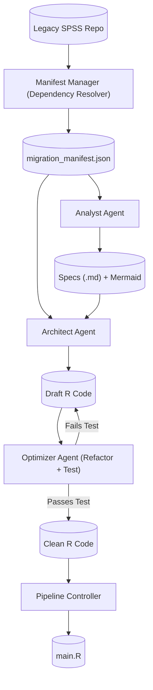

# migration
Here is the comprehensive `README.md` for the Legacy Migration Pipeline. It documents the architecture, the workflow, and the specific engineering decisions we made (like the "Manifest-Driven" approach and the "Optimizer" safety net).

---

# SPSS to R Migration Pipeline

## 1. Overview

This project implements an automated, deterministic pipeline for migrating legacy SPSS syntax (`.sps`) into modern, idiomatic R code (`tidyverse`).

Unlike simple "transpilers" that do line-by-line translation, this pipeline uses a **Multi-Agent Architecture** to:

1. **Extract Intent:** Reverse-engineer business logic into human-readable specifications.
2. **Architect Solutions:** Re-implement that logic using modern R best practices.
3. **Optimize & Verify:** Iteratively refactor code for readability while guaranteeing functionality via automated testing.
4. **Orchestrate:** Automatically resolve dependencies and build a master execution script (`main.R`).

## 2. System Architecture

The pipeline operates in stages, controlled by a central **Manifest**.



---

## 3. Directory Structure

The pipeline assumes a specific structure to separate legacy source, intermediate specs, and final output.

```text
/
├── syntax/                 # SOURCE: Your legacy .sps files
│   ├── 01_calc_delays.sps
│   ├── 02_summarize_deaths.sps
│   └── Run_Pipeline.sps    # Legacy Controller
├── specs/                  # GENERATED: Markdown specifications
├── r_from_spec/            # GENERATED: The Migrated R functions
├── main.R                  # GENERATED: The R Orchestrator
├── input_data.csv          # DATA: Test/Production data
├── migration_manifest.json # SYSTEM: The Source of Truth
└── src/                    # TOOLING: Python source code
    ├── specs/              # Agent logic (Analyst, Architect, Optimizer)
    └── utils/              # Helpers (Manifest, Dependency Resolver)

```

---

## 4. The Workflow

Run these commands in order to perform a full migration.

### Step 1: Initialize the Manifest

Scans the legacy repo, identifies dependencies (via `INSERT FILE`), calculates the execution order (Topological Sort), and sanitizes filenames.

```bash
python -m src.utils.manifest_manager

```

* **Output:** `migration_manifest.json` and `architecture.md`.
* **Key Feature:** Detects which files are "Logic" (to be migrated) and which are "Controllers" (to be replaced).

### Step 2: The Analyst (Reverse Engineering)

Reads the SPSS code and generates a Business Requirement Document, ignoring implementation details (e.g., date math) to focus on intent.

```bash
python -m src.specs.analyst

```

* **Output:** `specs/*.md` containing Mermaid flowcharts and Data Dictionaries.

### Step 3: The Architect (Draft Generation)

Reads the Spec and writes the initial R function.

* **Constraint:** Enforces `tidyverse` style but may contain "hallucinated" syntax or non-idiomatic logic.

```bash
python -m src.specs.architect

```

* **Output:** `r_from_spec/*.R` (Draft quality).

### Step 4: The Optimizer (Refactor & Verify)

The crucial quality assurance step. It takes the Draft R code and:

1. **Mutates:** Asks LLM to make it "Human-like" (e.g., `substr` -> `ymd`).
2. **Tests:** Runs the code against `input_data.csv`.
3. **Decides:** If the new code crashes or flips logic (e.g., negative delays), it **reverts** to the Draft version.

```bash
python -m src.specs.optimizer

```

* **Output:** Polished, verified R code in `r_from_spec/`.

### Step 5: The Controller (Orchestration)

Reads the Manifest order and builds the final R script to run the whole pipeline. It automatically skips legacy controller scripts.

```bash
python -m src.specs.controller

```

* **Output:** `main.R`.

### Step 6: Execution

Run the final migrated pipeline.

```bash
Rscript main.R

```

---

## 5. Component Details

### A. Manifest Manager & Dependency Resolver

* **Problem:** Legacy scripts often run in an arbitrary order or rely on a "Master Script."
* **Solution:** We built a `DependencyResolver` that parses `INSERT/INCLUDE` commands to build a Directed Acyclic Graph (DAG).
* **Role Detection:** Files that call other files are tagged as `role: controller` and are **not** converted to R functions; they are replaced by `main.R`.

### B. The Analyst Agent

* **Problem:** LLMs tend to translate line-by-line (e.g., "Divide by 86400").
* **Solution:** The Analyst prompt is instructed to **Abstract** the logic. It documents "Calculate Duration in Days" rather than the math, allowing the Architect to use modern R functions (`difftime`) instead of legacy hacks.

### C. The Optimizer (Genetic Programming)

* **Problem:** LLMs often hallucinate syntax (e.g., `interval(days=0)`) or invert logic (e.g., `Death - Registration` = Negative Delay).
* **Solution:** The Optimizer works on a "Survival of the Fittest" model.
* It snapshots the working code.
* It applies a "Humanizing" refactor.
* It executes a micro-test in R.
* **Fail-Safe:** If the test fails (runtime error or empty output), the changes are discarded.


---

## 6. Troubleshooting

**Issue: "Negative Delays" in Output**

* *Cause:* The LLM subtracted dates in English order ("Difference between Death and Reg" -> `Death - Reg`).
* *Fix:* The `src/specs/optimizer.py` contains a specific test case checking for `delay < 0`. If detected, it rejects the bad code. Run the Optimizer again.

**Issue: "Function Not Found" in `main.R**`

* *Cause:* Naming mismatch between the file and the function definition.
* *Fix:* The `ManifestManager` enforces sanitized names (stripping leading numbers like `01_`). Re-run `manifest_manager` then `architect`.

**Issue: Dependencies out of order**

* *Cause:* The legacy code might not use `INSERT` commands, leaving the Resolver guessing.
* *Fix:* Manually edit the order in `migration_manifest.json`. The pipeline respects this file as the Source of Truth.