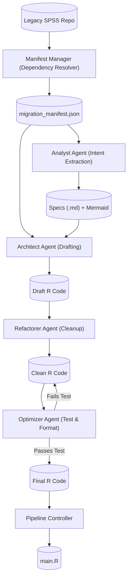

Here is the comprehensive `README.md` for your **Deterministic Legacy Migration Pipeline**. This documentation covers the architecture, setup, workflow, and the engineering philosophy behind the "Self-Healing" logic we built.

You can save this directly to `README.md` in the root of your migration tool repository.

---

# 🏗️ SPSS to R Migration Pipeline

**A Deterministic, Multi-Agent System for Legacy Code Migration.**

This project implements an automated pipeline to migrate legacy SPSS syntax (`.sps`) into modern, idiomatic R (`tidyverse`). Unlike simple transpilers, this system uses a **Manifest-Driven Architecture** and a **Genetic Optimizer** to ensure that migrated code is not only syntactically correct but also stylistically clean and functionally verified.

---

## 🏛️ System Architecture

The pipeline operates as a sequence of specialized agents, orchestrated by a central **Manifest** (the Source of Truth).



---

## 🛠️ Prerequisites

### 1. Python Environment

* **Python 3.9+**
* **Ollama:** Running locally (serving the model, e.g., `llama3` or `codellama`).
* **Dependencies:** `pandas` (for data generation).

### 2. R Environment

The pipeline executes R code for testing and formatting. Ensure these packages are installed:

```bash
Rscript -e 'install.packages(c("tidyverse", "lintr", "styler", "lubridate"), repos="http://cran.rstudio.com/")'

```

---

## 📂 Directory Structure

The pipeline imposes a strict structure to separate source, intermediate, and output files.

```text
/
├── migration_manifest.json # SYSTEM: The Single Source of Truth
├── main.R                  # GENERATED: The Master R Controller
├── input_data.csv          # DATA: Test/Production data
├── snapshots/              # HISTORY: Version control for the Optimizer
│   └── calc_delays/
│       ├── v176642_original.R
│       └── v176642_optimized_success.R
├── syntax/                 # SOURCE: Legacy SPSS files
│   ├── 01_calc_delays.sps
│   └── Run_Pipeline.sps
├── specs/                  # GENERATED: Business Logic Specs
│   └── calc_delays.md
├── r_from_spec/            # GENERATED: The Migrated R Functions
│   └── calc_delays.R
└── src/                    # TOOLING:
    ├── specs/              # Agent Logic (Analyst, Architect, Optimizer)
    └── utils/              # Core Utilities (Manifest, Ollama Client)

```

---

## 🚀 The Migration Workflow

Run these commands in order to perform a full migration.

### Step 1: Initialize the Manifest

Scans the legacy repository, parses `INSERT/INCLUDE` commands to determine the execution order, and sanitizes filenames.

```bash
python -m src.utils.manifest_manager

```

* **Role:** Creates the "Flight Plan." Identifies which scripts are **Logic** (to migrate) and which are **Controllers** (to replace).
* **Output:** `migration_manifest.json`

### Step 2: The Analyst (Reverse Engineering)

Reads the SPSS code and extracts the **Business Intent**, ignoring legacy implementation details (e.g., ignores `trunc(date / 10000)` and writes "Parse Date").

```bash
python -m src.specs.analyst

```

* **Output:** `specs/*.md` (Markdown Specs with Mermaid Diagrams).

### Step 3: The Architect (Drafting)

Translates the Specs into functional R code.

* **Philosophy:** Focuses on logic structure, not perfect syntax. May contain "hallucinations" or non-idiomatic code.

```bash
python -m src.specs.architect

```

* **Output:** `r_from_spec/*.R` (Draft Quality).

### Step 4: The Refactorer (Static Cleanup)

Applies a strict set of regex-based and LLM-based rules to fix common errors before testing.

* **Rules:** Removes "SPSS Date Math," fixes "Time Arrow" inversions (`Death - Reg` -> `Reg - Death`).

```bash
python -m src.specs.refactorer

```

* **Output:** Cleaner R code.

### Step 5: The Optimizer (Test & Polish)

The **Quality Assurance** engine. It uses a "Genetic" approach:

1. **Snapshots** the current code.
2. **Mutates** it (LLM tries to make it "idiomatic").
3. **Formats** it (uses `styler` for whitespace).
4. **Tests** it (runs against `input_data.csv`).
* *If Test Fails:* Reverts to the snapshot.
* *If Test Passes:* Commits the change.


5. **Lints** it (uses `lintr` for final scoring).

```bash
python -m src.specs.optimizer

```

* **Output:** Verified, Formatted, and Linted R code.

### Step 6: The Controller (Orchestration)

Builds the final `main.R` script based on the Manifest's execution order.

```bash
python -m src.specs.controller

```

* **Output:** `main.R`

### Step 7: Final Execution

Run your fully migrated pipeline.

```bash
Rscript main.R

```

---

## 🧠 Key Engineering Concepts

### 1. Manifest-Driven Development

We do not rely on file names or folder scanning during the migration. The `migration_manifest.json` is the database of the migration. If you need to change the execution order, you edit the JSON, not the file names.

### 2. Genetic Optimization

LLMs are prone to "Regressions" (fixing style but breaking logic). Our **Optimizer Agent** wraps the LLM in a sandbox.

* It is allowed to write bad code, but that code **never survives**.
* It explicitly checks for domain-specific failures, such as **Negative Delays** (Time Arrow violation), and auto-reverts.

### 3. The "Uncanny Valley" of Code

LLMs often write code that works but looks "weird" (e.g., `ymd(paste(substr(...)))`). We use a multi-pass approach:

* **Analyst:** Abstract the math away.
* **Refactorer:** Hunt and destroy specific anti-patterns.
* **Styler:** Mechanically enforce PEP-8 equivalent standards (via `styler` package).

---

## ❓ Troubleshooting

| Issue | Cause | Fix |
| --- | --- | --- |
| **"FATAL: Data not found"** | The Optimizer is looking in the wrong folder. | Ensure `migration_manifest.json` has absolute paths or that `optimizer.py` logic correctly resolves the repo root. |
| **"Negative Delay Detected"** | Logic inversion (`Date_Death - Date_Reg`). | The **Refactorer** should catch this. If not, the **Optimizer** test will fail and revert. Check `snapshots/` to see the failed attempt. |
| **"Lintr errors remain"** | `dplyr` variable shadowing. | The pipeline is configured to ignore `object_usage_linter` errors, as `tidyverse` functions often look like global variable violations to static analysis. |
| **"Empty Result"** | Filter logic removed all rows. | Usually caused by the Logic Inversion bug (filtering for `>0` when all values are negative). |