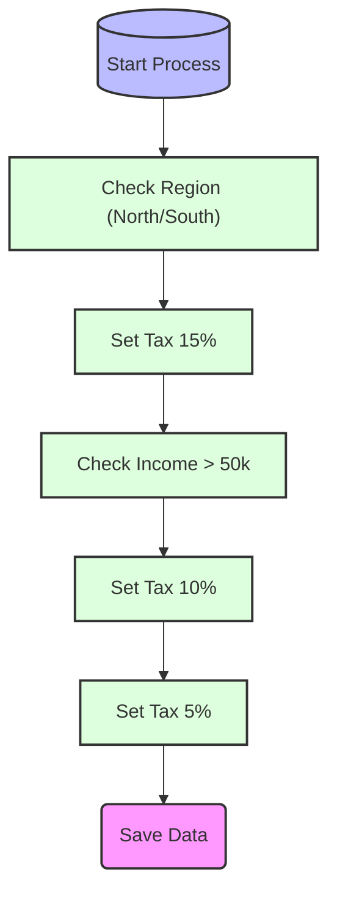

# Documentation: demo_complex_logic

## 1. Executive Summary
Calculates tax based on Region and Income tiers (North=15%, South=10%, Others=5%).

## 2. Process Flowchart

## 3. Original Source
* **File:** `demo_script.sps`
* **Migrated To:** `demo_script.R`
