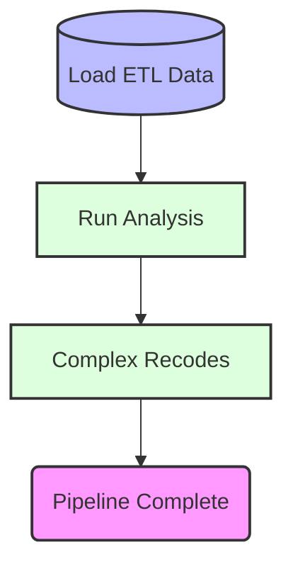

# Documentation: run_pipeline

## 1. Executive Summary
**Objective:** The SPSS script automates the data processing and analysis for a project, ensuring that all necessary calculations are performed efficiently.

**Key Steps:**
- **ETL (Extract, Transform, Load):** This step imports raw data from various sources, cleans it, and prepares it for further analysis.
- **Summarize Deaths:** Calculates key statistics related to deaths, such as total number of deaths, average age at death, and distribution by region.
- **Complex Logic:** Applies advanced rules and transformations to the data, which may include recoding variables, creating new metrics, or filtering specific subsets of the data.

**Outcome:** The final dataset will contain comprehensive summaries and analyses based on the input data, providing insights that can be used for decision-making.

## 2. Process Flowchart

## 3. Original Source
* **File:** `Run_Pipeline.sps`
* **Migrated To:** `run_pipeline.R`
