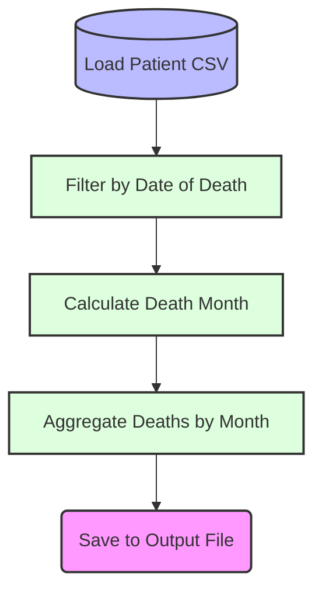

# Documentation: summarize_deaths

## 1. Executive Summary
### Objective:
Summarize the number of deaths by month.

### Key Steps:
- Extracts the month from the `date_death` variable.
- Groups the data by the extracted month.
- Counts the total number of deaths for each month.

### Outcome:
The final dataset will show the total number of deaths for each month, allowing you to see trends over time.

## 2. Process Flowchart

## 3. Original Source
* **File:** `02_summarize_deaths.sps`
* **Migrated To:** `summarize_deaths.R`
