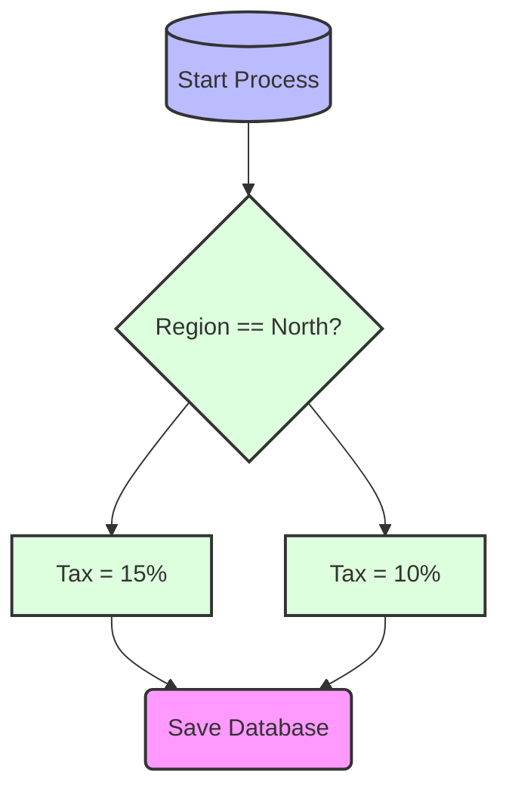

# Diagram Preview
Press `Ctrl + Shift + V` to view this diagram.

```mermaid
graph TD;
    classDef script fill:#f9f,stroke:#333,stroke-width:2px;
    classDef data fill:#bbf,stroke:#333,stroke-width:2px;
    classDef logic fill:#dfd,stroke:#333,stroke-width:2px;
    Start[("Start Process")];
    CheckRegion{"Region == North?"};
    NorthBranch["Tax = 15%"];
    SouthBranch["Tax = 10%"];
    Save("Save Database");
    Start --> CheckRegion
    CheckRegion --> NorthBranch
    CheckRegion --> SouthBranch
    NorthBranch --> Save
    SouthBranch --> Save
    class Start data;
    class CheckRegion logic;
    class NorthBranch logic;
    class SouthBranch logic;
    class Save script;
```